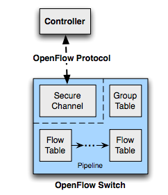

# OpenFlow Switch Architecture

## Table of Content
- [OpenFlow Switch Overview](#openflow-switch-overview)
- [OpenFlow Ports](#openflow-ports)
  - [Physical Ports](#physical-ports)
  - [Logical Ports](#logical-ports)
  - [Reserved Ports](#reserved-ports)
  - [Standard Ports](#standard-ports)
- [OpenFlow Table](#openflow-table)
  - [Pipeline Processing](#pipeline-processing)
  - [Flow Table](#flow-table)
  - [Group Table](#group-table)
  - [Meter Table](#meter-table)
  - [Counters](#counters)
  - [Instructions](#instructions)
  - [Actions](#actions)


## OpenFlow Switch Overview



* OpenFlow Channel


## OpenFlow Ports

### Physical Ports

Physical ports 是指 switch 上實體的 port，在 legacy switch中通常就是physical port 和 ethernet 介面一對一對應，在 port在某些應用中，可以把一台OpenFlow switch 虛擬切成多台或多個VLAN


### Logical Ports

一種邏輯抽象的port，這邊也特別指跟 OpenFlow Protocol無關的，譬如：link aggregation、tunnel 和 loop back ，而OpenFlow  protocol 定義的抽象 port 會歸類在 Reserved Port。

 logical port 比起 physical port ，可能會多帶一些訊息，譬如說 Tunnel ID，所以需要多一層 interface來做封包 encapsulation，一個logical port 也可能對應到多個 physical port。


### Reserved Ports

OpenFlow 定義的 Port

|    Port    | Require/Optional | As In/Out |
| :--------: | :--------------: | :-------: |
|    All     |     Require      |    out    |
| Controller |     Require      |  in/out   |
|   Table    |     Require      |    out    |
|  In_Port   |     Require      |    out    |
|    Any     |     Require      |     x     |
|   Local    |     Optional     |  in/out   |
|   Normal   |     Optional     |    out    |
|   Flood    |     Optional     |    out    |


#### All (Require)

Output 到這個 port 表示送封包到 switch 上所有的 [Standard Ports](#standard-ports) （Flooding），除了 Ingress Port 還有設定了 [`OFPPC_NO_FWD`](#port-config) 的 port。

#### Controller (Require)

表示和 controller 之間的 secure channel

Output Port： 送往controller

Input Port：來自controller

#### Table (Require)

讓封包再回去 pipeline 處理一次。

####In_Port (Require)

表示封包進來的那個 port，可以當作是 output port 將封包送回去。

#### Any (Require)

Wildcard/Don't care.

#### Local (Optional)

代表往 switch 自己的 management stack 送。

傳統的陽春的 switch 只需要到 layer2，不需要 layer3~5 的 stack，但是較好的會有 management 的功能，譬如像有些router會有管理介面，可以透過網頁瀏覽器來設定 router， web server (HTTP/HTTPS) 來控制router，而可以去到這樣的介面表示說那個 router 會有實作 web server (HTTP/HTTPS) ，stack 至少到 layer 4，才能讓管理人員透過介面來設定 router。

而往 local 的意思就是往自己的network stack 上的 management interface 送。

#### Normal (Optional)

用 legacy (non-OpenFlow) 的 pipeline 處理

#### Flood (Optional)

用 legacy (non-OpenFlow) 的 pipeline 做 flooding，會送往所有的 [Standard Port](### Standard Ports)，除了 Ingress Port 還有設定了 [`OFPPS_BLOCKED` ](#port-state)的 port。


### Standard Ports

標準的 port 包含 physical port , logical port 和 LOCAL if support


### Port Structure

#### Port

```C
/* Description of a port */
struct ofp_port {
  uint32_t port_no;		
  uint8_t pad[4];		
  uint8_t hw_addr[OFP_ETH_ALEN];	/* MAC Address */
  uint8_t pad2[2];
  char name[OFP_MAX_PORT_NAME_LEN]; /* Can be Named by manager. Null-terminated */
  uint32_t config;		/* Bitmap of OFPPC_* flags. */
  uint32_t state;		/* Bitmap of OFPPS_* flags. */


  /* Bitmaps of OFPPF_* that describe features.  All bits zeroed if
   * unsupported or unavailable. */
  uint32_t curr;		/* Current features. */	
  uint32_t advertised;	/* Features being advertised by the port. */
  uint32_t supported;	/* Features supported by the port. */
  uint32_t peer;		/* Features advertised by peer. */
  uint32_t curr_speed;	/* Current port bitrate in kbps. */
  uint32_t max_speed;	/* Max port bitrate in kbps */
};
OFP_ASSERT(sizeof(struct ofp_port) == 64);	/* Align to 64 bits. */
```


#### Port Config

`OFPPC_*` flags

```C
/* Flags to indicate behavior of the physical port.  These flags are
 * used in ofp_port to describe the current configuration.  They are
 * used in the ofp_port_mod message to configure the port’s behavior.
 */
enum ofp_port_config {
  OFPPC_PORT_DOWN = 1 << 0,  	/* Port is administratively down. */
  OFPPC_NO_RECV = 1 << 2,  		/* Drop all packets received by port. */
  OFPPC_NO_FWD = 1 << 5,  		/* Drop packets forwarded to port. */
  OFPPC_NO_PACKET_IN = 1 << 6   /* Do not send packet-in msgs for port. */
};
```


#### Port State

`OFPPS_*` flags

```C
/* Current state of the physical port.  These are not configurable from
 * the controller.
 */
enum ofp_port_state {
    OFPPS_LINK_DOWN = 1 << 0;	/* No physical link present. */
    OFPPS_BLOCKED = 1 << 1;		/* Port is blocked */
    OFPPS_LIVE = 1 << 2;		/* Live for Fast Failover Group. */
};
```


#### Port Feature

`OFPPP_*` flags

```C
/* Features of ports available in a datapath. */
enum ofp_port_features {
OFPPF_10MB_HD = 1 << 0, 	/* 10 Mb half-duplex rate support. */
OFPPF_10MB_FD = 1 << 1, 	/* 10 Mb full-duplex rate support. */
OFPPF_100MB_HD = 1 << 2, 	/* 100 Mb half-duplex rate support. */
OFPPF_100MB_FD = 1 << 3, 	/* 100 Mb full-duplex rate support. */
OFPPF_1GB_HD = 1 << 4, 		/* 1 Gb half-duplex rate support. */ 
OFPPF_1GB_FD = 1 << 5, 		/* 1 Gb full-duplex rate support. */ 
OFPPF_10GB_FD = 1 << 6, 	/* 10 Gb full-duplex rate support. */
OFPPF_40GB_FD = 1 << 7, 	/* 40 Gb full-duplex rate support. */
OFPPF_100GB_FD = 1 << 8, 	/* 100 Gb full-duplex rate support. */
OFPPF_1TB_FD  = 1 << 9, 	/* 1 Tb full-duplex rate support. */
OFPPF_OTHER = 1 << 10, 		/* Other rate, not in the list. */

OFPPF_COPPER = 1 << 11, 	/* Copper medium. */
OFPPF_FIBER = 1 << 12, 		/* Fiber medium. */
OFPPF_AUTONEG = 1 << 13, 	/* Auto-negotiation. */
OFPPF_PAUSE = 1 << 14, 		/* Pause. */
OFPPF_PAUSE_ASYM = 1 << 15  /* Asymmetric pause. */
```


## OpenFlow Table

### Pipeline Processing

###Flow Table

#### Flow Entry

#### Flow Removal

### Group Table

### Meter Table

### Counters

### Instructions

### Actions

#### Action List

#### Action Set

#### Actions

### 