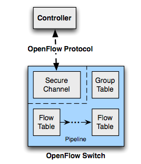

# OpenFlow Switch Architecture

[TOC]

## OpenFlow Switch Overview




## OpenFlow Ports

### Physical Ports

Physical ports 是指 switch 上實體的 port，在 legacy switch中通常就是physical port 和 ethernet 介面一對一對應，在 port在某些應用中，可以把一台OpenFlow switch 虛擬切成多台或多個VLAN


### Logical Ports

一種邏輯抽象的port，這邊也特別指跟 OpenFlow Protocol無關的，譬如：link aggregation、tunnel 和 loop back ，而OpenFlow  protocol 定義的抽象 port 會歸類在 Reserved Port。

 logical port 比起 physical port ，可能會多帶一些訊息，譬如說 Tunnel ID，所以需要多一層 interface來做封包 encapsulation，一個logical port 也可能對應到多個 physical port。


### Reserved Ports

OpenFlow 定義的 Port

#### All (Require)

Output 到這個 port 表示送封包到 switch 上所有的 [Standard Ports](#standard-ports) （Flooding），除了 Ingress Port 還有設定了 [`OFPPC_NO_FWD`](#port-config) 的 port。

#### Controller (Require)

表示和 controller 之間的 secure channel

Output Port： 送往controller

Input Port：來自controller

#### Table (Require)

讓封包再回去 pipeline 處理一次。

####In_Port (Require)

表示封包進來的那個 port，可以當作是 output port 將封包送回去。

#### Any (Require)

Wildcard/Don't care.

#### Local (Optional)

代表往 switch 自己的 management stack 送。

傳統的陽春的 switch 只需要到 layer2，不需要 layer3~5 的 stack，但是較好的會有 management 的功能，譬如像有些router會有管理介面，可以透過網頁瀏覽器來設定 router， web server (HTTP/HTTPS) 來控制router，而可以去到這樣的介面表示說那個 router 會有實作 web server (HTTP/HTTPS) ，stack 至少到 layer 4，才能讓管理人員透過介面來設定 router。

而往 local 的意思就是往自己的network stack 上的 management interface 送。

#### Normal (Optional)

用 legacy (non-OpenFlow) 的 pipeline 處理

#### Flood (Optional)

用 legacy (non-OpenFlow) 的 pipeline 做 flooding，會送往所有的 [Standard Port](### Standard Ports)，除了 Ingress Port 還有設定了 [`OFPPS_BLOCKED` ](#port-state)的 port。

#### 整理

|    Port    | Require/Optional | As In/Out |
| :--------: | :--------------: | :-------: |
|    All     |     Require      |    out    |
| Controller |     Require      |  in/out   |
|   Table    |     Require      |    out    |
|  In_Port   |     Require      |    out    |
|    Any     |     Require      |     x     |
|   Local    |     Optional     |  in/out   |
|   Normal   |     Optional     |    out    |
|   Flood    |     Optional     |    out    |


### Standard Ports

Standard port 包含 physical port , logical port 和 LOCAL if support


### Port Structure

#### Port Description

```C
/* Description of a port */
struct ofp_port {
  uint32_t port_no;		
  uint8_t pad[4];		
  uint8_t hw_addr[OFP_ETH_ALEN];	/* MAC Address */
  uint8_t pad2[2];
  char name[OFP_MAX_PORT_NAME_LEN]; /* Can be Named by manager. Null-terminated */
  uint32_t config;		/* Bitmap of OFPPC_* flags. */
  uint32_t state;		/* Bitmap of OFPPS_* flags. */


  /* Bitmaps of OFPPF_* that describe features.  All bits zeroed if
   * unsupported or unavailable. */
  uint32_t curr;		/* Current features. */	
  uint32_t advertised;	/* Features being advertised by the port. */
  uint32_t supported;	/* Features supported by the port. */
  uint32_t peer;		/* Features advertised by peer. */
  uint32_t curr_speed;	/* Current port bitrate in kbps. */
  uint32_t max_speed;	/* Max port bitrate in kbps */
};
OFP_ASSERT(sizeof(struct ofp_port) == 64);	/* Align to 64 bits. */
```


#### Port Config

`OFPPC_*` flags

```C
/* Flags to indicate behavior of the physical port.  These flags are
 * used in ofp_port to describe the current configuration.  They are
 * used in the ofp_port_mod message to configure the port’s behavior.
 */
enum ofp_port_config {
  OFPPC_PORT_DOWN = 1 << 0,  	/* Port is administratively down. */
  OFPPC_NO_RECV = 1 << 2,  		/* Drop all packets received by port. */
  OFPPC_NO_FWD = 1 << 5,  		/* Drop packets forwarded to port. */
  OFPPC_NO_PACKET_IN = 1 << 6   /* Do not send packet-in msgs for port. */
};
```


#### Port State

`OFPPS_*` flags

```C
/* Current state of the physical port.  These are not configurable from
 * the controller.
 */
enum ofp_port_state {
    OFPPS_LINK_DOWN = 1 << 0;	/* No physical link present. */
    OFPPS_BLOCKED = 1 << 1;		/* Port is blocked */
    OFPPS_LIVE = 1 << 2;		/* Live for Fast Failover Group. */
};
```


#### Port Feature

`OFPPP_*` flags

```C
/* Features of ports available in a datapath. */
enum ofp_port_features {
OFPPF_10MB_HD = 1 << 0, 	/* 10 Mb half-duplex rate support. */
OFPPF_10MB_FD = 1 << 1, 	/* 10 Mb full-duplex rate support. */
OFPPF_100MB_HD = 1 << 2, 	/* 100 Mb half-duplex rate support. */
OFPPF_100MB_FD = 1 << 3, 	/* 100 Mb full-duplex rate support. */
OFPPF_1GB_HD = 1 << 4, 		/* 1 Gb half-duplex rate support. */ 
OFPPF_1GB_FD = 1 << 5, 		/* 1 Gb full-duplex rate support. */ 
OFPPF_10GB_FD = 1 << 6, 	/* 10 Gb full-duplex rate support. */
OFPPF_40GB_FD = 1 << 7, 	/* 40 Gb full-duplex rate support. */
OFPPF_100GB_FD = 1 << 8, 	/* 100 Gb full-duplex rate support. */
OFPPF_1TB_FD  = 1 << 9, 	/* 1 Tb full-duplex rate support. */
OFPPF_OTHER = 1 << 10, 		/* Other rate, not in the list. */

OFPPF_COPPER = 1 << 11, 	/* Copper medium. */
OFPPF_FIBER = 1 << 12, 		/* Fiber medium. */
OFPPF_AUTONEG = 1 << 13, 	/* Auto-negotiation. */
OFPPF_PAUSE = 1 << 14, 		/* Pause. */
OFPPF_PAUSE_ASYM = 1 << 15  /* Asymmetric pause. */
```


## OpenFlow Table

### Pipeline Processing


#### Per Table Processing

1. 找到最大優先權的 matching flow entry
2. Apply Instructions
   1. Modify Packet & update Match Fieid
   2. Update Action Set ( clear actions and/or write actions instructions)
   3. Update metadata

3. Send match data and action set to next table


ps. meta data 是用在 table 之間溝通的，前一個 table 可以利用 update meta 來暫存資訊傳給後一個 table ，但是目前很多 switch 都只有實作一張 table，就沒辦法使用這項功能。


#### FlowChart


###Flow Table

其實Flow Table 通常會有三份，一份就是大部分我們在說在 Switch 晶片上的 table，另一份是實作的時候通常 controller 也會記著說現在有哪些 flow entry ，最後一份是 switch OS 上，switch OS 上有一 driver 區用來控制晶片，他裡面其實也存了一個 軟體的 flow table。


#### Flow Entry

- Match Field：各種 packet header的組合（optionally metadata)

- Priority

- Counters：統計資訊

- Instructions：更改 action sets 或 pipeline 的流程

- Timeouts：這個 Entry 可以在 Flow Table 存活多久

- Cookie：網管人員自己設定的附加資訊

  ​

#### Flow Removal

Flow table是有限資源，需要有機制能夠清掉 Flow Entry

- Controller：Controller 直接下命令叫 Switch 清掉
- Switch
  - Hard_timeout：不管有沒有 match ，下這個 Entry 後過多久會刪掉
  - Idle_timeout：沒有 match 持續超過多久時間，就會刪掉


ps. OpenFlow 1.5 的 Flow table 可以有 Cache 功能，如果一個 rule 下來，發現沒位置了，會隨機挑一個 Entry 刪掉


### Group Table

看了蠻久，才懂 Group Table 在做什麼，其中的精華在於 Action Bucket 的應用

#### Group Table Entry

- Group ID
- Group Type：Group 的類型，也就是如何去使用這個 Group 裡的 Action Buckets
- Counters：紀錄有多少 packet 被這個 Group 處理
- Action Buckets：an **order list** of action buckets

由上面可以得知，Action Buckets 是一連串並且有順序的 Action bucket 所組成


packet 基本上會根據 Group Type 而對 bucket 有不同的選擇


#### Group Type

Group Type 有四種：All、Select、Indirect 和 Failover

接下來以例子來說明這四個的不同：假設現在一台 Switch 有 4 個 port，然後 Group Table 中有一個 Group 如下


##### All (Require)

> Execute all buckets in the group. This group is used for multicast or broadcast forwarding. The packet is effectively cloned for each bucket; one packet is processed for each bucket ofthe group.

如果 Group Type 是 All 的話，這個 packet 會執行這個 Group 裡所有的 Action bucket，以這個例子來說，packet 被複製成四份送往四個 port，達到 broadcast/flooding的效果


> If a bucket directs a packet explicitly out the ingress port, this packet clone is dropped. If the controller writer wants to forward out the ingress port, the group should include an extra bucketwhich includes an output action to the OFPP_IN_PORT reserved port.
要注意的是 packet 如果送往 In_Port 的話，packet 會被自動 drop 掉

如果需要讓封包也送往 In_Port的話，必須增加一個 Action Bucket


##### Select (Optional)

> Execute one bucket in the group. Packets are processed by a single bucket in thegroup, based on a switch-computed selection algorithm (e.g. hash on some user-configured tuple orsimple round robin).

如果 Group Type 是 Select 的話，Switch 會自己透過演算法選擇出一個 Action Bucket 來執行


以這個例子來說，switch會隨機找一個port來送packet出去，所以可以達到 Load Balance的效果


##### Fast Failover (Optional)

> Each action bucket is associated with a specificport and/or group that controls its liveness. The buckets are evaluated in the order defined by thegroup, and the first bucket which is associated with a live port/group is selected. This group typeenables the switch to change forwarding without requiring a round trip to the controller. If no bucketsare live, packets are dropped.


Group 也可以拿來處理 Failover，如果每個action bucket都跟一個port有關，當switch知道選擇的 action bucket 連到的 port 不能使用的時候，他會直接往下一個 action bucket 來執行，以這個例子來說，假設選到往 port1 的 action bucket，發現 port 1 不能用，所以他會直接往下個看，也就是直接往port 2 送，這樣可以直接透過 switch 來處理，避免失敗了還要上去問 controller 花費 round trip 的時間

如果所有 Action Bucket 都失敗的話，則封包會被 drop 掉


##### Indirect (Require)

在這個類型當中，一個Group 只能有一個 action bucket，也就是說這個 Type 沒有在選擇 bucket的問題，他主要是用在多個 Flow 可能會有一樣的行為時，可以統一一起處理。


以上面的例子來說，Flow 1,3,4都是屬於Group1，也就是要 forward 到 port 2，如果port 2 壞掉，要一個一個改 Instruction 很麻煩，所以我們會將它們設成同一個 Group，然後直接去改 Group 的 Action 就好，這樣比較方便


##### Group Table 整理

|  Group Type   |   spec   | Action Bucket 數量 |               功能               |
| :-----------: | :------: | :--------------: | :----------------------------: |
|      All      | require  |        多         |       Broadcast/Flooding       |
|    Select     | optional |        多         |         Load Balancing         |
| Fast Failover | optional |        多         | failover handling/ reliability |
|   Indirect    | require  |        一個        |   more efficient convergence   |


### Meter Table

work in progress


ps. Queue 和 Meter 不同的是，Queue 主要的目的不是去測量速度多少，而是分優先權，如果設定這個 flow 到 priority 高的 queue，封包則會被優先送出，做差別服務的功能，而 meter 會去測量 flow 的速度。

ps2. 每家廠牌在這方面的實作都會不太一樣，以 pica8 來說，也可以針對 Queue 來限定他的最高速度，但如果多個 flow 都送進了同個 Queue ，則他們會 share 那個速度，無法針對單一 flow 做設定，而如果對 flow 下 Meter，就會去測量每個 flow 的速度，分別作限速。


### Counters

### Instructions

### Actions

#### Action List

#### Action Set

#### Actions

### 